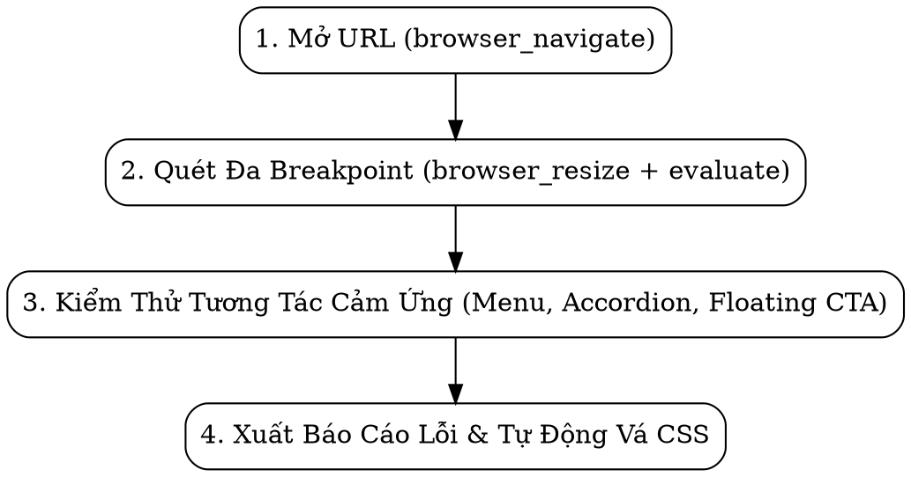

# WordPress Responsive & Visual Audit (Playwright MCP)

Quy trình tự động hóa kiểm tra tính thích ứng (Responsive Design), bố cục di động và trải nghiệm hiển thị của WordPress Theme trên mọi kích thước màn hình bằng công cụ **Playwright MCP**.

---

## Khi Nào Sử Dụng

- Sử dụng khi: *"Kiểm tra responsive"*, *"Test giao diện mobile"*, *"Audit responsive theme"*, *"Chụp ảnh màn hình các breakpoint"*, *"Kiểm tra tràn ngang (horizontal scroll)"*.
- Là **Phase 6** bắt buộc trong quy trình chuyển đổi theme WordPress ([wp-theme-converter](../wp-theme-converter/SKILL.md)) trước khi nghiệm thu bàn giao dự án.

---

## Quy Trình Kiểm Thử 4 Bước Tự Động (Playwright MCP Workflow)



---

### Bước 1: Khởi Tạo Môi Trường Kiểm Thử
Sử dụng công cụ `browser_navigate` để mở đường dẫn trang web cần kiểm tra (Trang chủ, Trang danh sách CPT, Trang chi tiết single, hoặc Trang liên hệ).

```text
Target: http://localhost:8080/ (hoặc URL dự án cục bộ)
```

---

### Bước 2: Quét Tự Động Qua Các Mốc Breakpoint Chuẩn

Chạy vòng lặp qua 3 mốc thiết bị đại diện bằng `browser_resize`:

#### 📱 Mốc 1: Mobile Tiêu Chuẩn (Width: 375px, Height: 812px)
1. Gọi `browser_resize(width: 375, height: 812)`.
2. Chạy script phát hiện tràn ngang qua `browser_evaluate`:
   ```javascript
   (() => {
     const docWidth = document.documentElement.clientWidth;
     const bad = [];
     document.querySelectorAll('*').forEach(el => {
       const r = el.getBoundingClientRect();
       if (r.right > docWidth || r.width > docWidth) {
         bad.push({ tag: el.tagName, class: el.className, w: Math.round(r.width) });
       }
     });
     return { hasScroll: document.documentElement.scrollWidth > docWidth, count: bad.length, bad: bad.slice(0, 5) };
   })()
   ```
3. Chạy script kiểm tra nút bấm nhỏ hơn 44x44px từ [playwright-eval-scripts.md](references/playwright-eval-scripts.md).
4. Chụp ảnh lưu bằng chứng: `browser_take_screenshot(filename: 'screenshot-mobile-375.png')`.

#### 📱 Mốc 2: Mobile Nhỏ Nhất (Width: 320px, Height: 667px)
1. Gọi `browser_resize(width: 320, height: 667)`.
2. Kiểm tra xem tiêu đề h1/h2, bảng giá hoặc breadcrumb có bị gãy vỡ layout không.
3. Chụp ảnh lưu bằng chứng: `browser_take_screenshot(filename: 'screenshot-mobile-320.png')`.

#### 💻 Mốc 3: Tablet Dọc (Width: 768px, Height: 1024px)
1. Gọi `browser_resize(width: 768, height: 1024)`.
2. Xác nhận lưới thẻ (Card grid) đã chuyển đổi hợp lý sang 2 cột (hoặc 3 cột).
3. Chụp ảnh lưu bằng chứng: `browser_take_screenshot(filename: 'screenshot-tablet-768.png')`.

#### 🖥️ Mốc 4: Desktop Chuẩn (Width: 1440px, Height: 900px)
1. Gọi `browser_resize(width: 1440, height: 900)`.
2. Kiểm tra container căn giữa cân đối, không bị kéo dãn bẹt hình.
3. Chụp ảnh: `browser_take_screenshot(filename: 'screenshot-desktop-1440.png')`.

---

### Bước 3: Kiểm Thử Tương Tác Cảm Ứng Di Động (Touch Testing)

1. **Kiểm tra Hamburger Menu Mobile**:
   - Sử dụng `browser_click` lên nút toggle menu (VD: `.navbar-toggler`, `.mobile-menu-btn`).
   - Kiểm tra Drawer Navigation có trượt ra mượt mà và che đúng lớp backdrop không.
   - Click nút đóng (`.close-btn`) hoặc click backdrop để xác nhận đóng menu.
2. **Kiểm tra Cụm Nút Liên Hệ Nổi (.floating-contact, Zalo, Hotline)**:
   - Cuộn trang xuống cuối (`window.scrollTo(0, document.body.scrollHeight)`).
   - Xác nhận cụm nút không đè lên nút "Gửi liên hệ" hoặc dòng Copyright dưới chân trang.
3. **Kiểm tra Bảng Thông Số Kỹ Thuật (Table Responsive)**:
   - Xác nhận các bảng dữ liệu có thể vuốt ngang cảm ứng độc lập mà không kéo lệch toàn bộ trang.

---

### Bước 4: Định Dạng Báo Cáo Lỗi & Phương Án Vá CSS

Báo cáo kết quả bằng Tiếng Việt theo cấu trúc sau:

```markdown
### 📊 Báo Cáo Kết Quả Kiểm Thử Responsive

| Breakpoint | Tràn Ngang (Scroll) | Vùng Chạm (<44px) | Menu Mobile | Đánh Giá Chung |
| :--- | :--- | :--- | :--- | :--- |
| **320px (Mobile S)** | ✅ Không | ⚠️ 2 nút (Search, Tag) | ✅ Mở tốt | 🟡 Minor |
| **375px (Mobile M)** | ✅ Không | ✅ Đạt chuẩn | ✅ Mở tốt | 🟢 Đạt |
| **768px (Tablet)**   | ✅ Không | ✅ Đạt chuẩn | ✅ Thu gọn | 🟢 Đạt |
| **1440px (Desktop)** | ✅ Không | ✅ Đạt chuẩn | ✅ Menu ngang | 🟢 Đạt |

#### Chi tiết các vấn đề cần khắc phục:
- **[Major / 320px]** Thẻ `.c-card-project .title`: Cỡ chữ 24px bị tràn khung trên màn hình 320px.
  - *Phương án vá CSS*: Dùng `font-size: clamp(1.1rem, 4vw, 1.5rem);`.
- **[Minor / Mobile]** Cụm nút Zalo `.floating-btn`: Đè nhẹ lên nút Submit form liên hệ ở chân trang.
  - *Phương án vá CSS*: Thêm `bottom: 80px` khi màn hình `< 576px`.
```

---

## Checklist Tiêu Chuẩn Đáp Ứng Trước Khi Bàn Giao

> 📖 **Tra cứu chi tiết**: Xem [breakpoints-checklist.md](references/breakpoints-checklist.md)

- [ ] Không có thanh cuộn ngang ngoài ý muốn ở bất kỳ kích thước màn hình nào (320px ➔ 2560px).
- [ ] Mọi nút bấm, link icon đạt kích thước tối thiểu 44x44px trên thiết bị di động.
- [ ] Font chữ body text hiển thị rõ nét từ 14px – 16px, heading co giãn bằng `clamp()`.
- [ ] Toàn bộ ảnh có `max-width: 100%` và `height: auto`, video/iframe co giãn theo tỷ lệ.
- [ ] Hamburger Menu / Mobile Drawer mở và đóng trơn tru, không gây cuộn trang nền.
- [ ] Các bảng dữ liệu được bọc trong container `.table-responsive` cuộn ngang riêng biệt.
- [ ] Đã chụp ảnh màn hình lưu bằng chứng tại các mốc 320px, 375px, 768px, 1440px.
