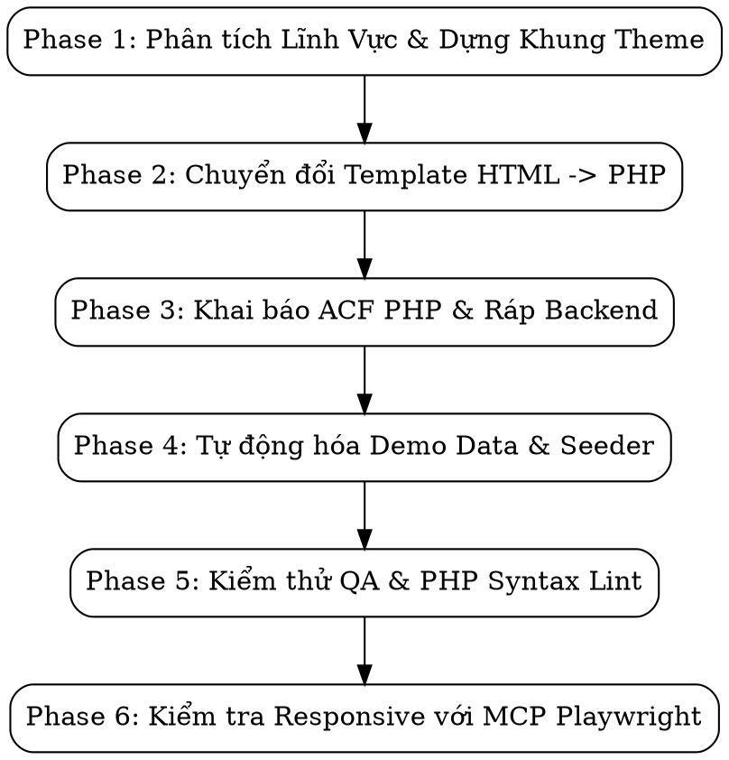

# WordPress Theme Converter (Universal Pipeline)

Quy trình tinh gọn (6-Phase Batch Pipeline) chuyển đổi toàn diện **bất kỳ bộ HTML template thuộc mọi ngành nghề/lĩnh vực** (Bất động sản, Y tế/Phòng khám, Giáo dục/Khóa học, Nhà hàng/F&B, Ô tô/Showroom, Agency/Doanh nghiệp, Bán hàng, Khách sạn...) sang WordPress Theme hoàn chỉnh, tích hợp Custom Post Types, Custom Taxonomies, ACF Pro Local PHP Fields, chuẩn hóa đa ngôn ngữ Polylang (với Fallback Shim an toàn) và hệ thống tự động Import Demo Data.

---

## Khi Nào Sử Dụng

- Sử dụng khi người dùng yêu cầu: *"Chuyển HTML sang WordPress"*, *"Tạo theme WP từ template"*, *"Convert template sang theme"*, *"Ráp backend ACF cho theme"*, *"Làm theme đa ngôn ngữ Polylang"*.
- **THAY THẾ SDD**: Không sử dụng `subagent-driven-development` hay TDD cho việc chuyển đổi theme WordPress vì theme không có unit test và việc chia nhỏ thành hàng chục subagents gây lãng phí 80% thời gian và token. Thay vào đó, áp dụng quy trình **Batch Execution (Thực thi theo đợt)** 6 Phase dưới đây.

---

## 6-Phase Batch Pipeline



---

### Phase 1: Phân Tích Lĩnh Vực & Dựng Khung Theme

> 📖 **Chi tiết quy tắc**: Xem [cpt-taxonomies.md](references/cpt-taxonomies.md), [html-conventions.md](references/html-conventions.md), và [polylang-helpers.md](references/polylang-helpers.md)

1. **Nhận diện Ngành nghề & Thực thể từ HTML**:
   - Quét tiêu đề trang, meta description và các file `*-detail.html` / `*-single.html` để nhận diện lĩnh vực kinh doanh (Bất động sản: dự án/căn hộ; Giáo dục: khóa học/giảng viên; Y tế: bác sĩ/chuyên khoa; Ẩm thực: món ăn/thực đơn; Doanh nghiệp: dịch vụ/dự án...).
   - Xác định CPT: Mỗi trang detail không phải blog (như `project-detail.html`, `course-detail.html`, `doctor-detail.html`, `car-detail.html`) ➔ 1 CPT tương ứng.
   - Xác định Custom Taxonomy: Phân tích các bộ lọc UI (tabs, pills, dropdowns, sidebar filter) trong trang danh sách để suy ra taxonomy phù hợp (danh mục, loại dịch vụ, phân khúc, địa điểm, thương hiệu...).
   - Xác định card lặp lại để chuẩn bị tách `template-parts/card-{cpt}.php`.
2. **Khởi tạo cấu trúc thư mục theme**:
   - Tạo các thư mục: `css/`, `js/`, `images/`, `libs/`, `core/`, `template-parts/`.
   - Sao chép toàn bộ assets (`libs/`, `images/`, `css/`, `js/`) từ HTML template sang thư mục theme.
3. **Tạo các file lõi**:
   - `style.css`: Khai báo thông tin theme WordPress chuẩn.
   - `core/types.php`: Đăng ký toàn bộ Custom Post Types và Taxonomies bằng mảng cấu hình động (`show_in_rest => true`).
   - `core/polylang.php`: Thiết lập tầng **Fallback Shim** cho Polylang (`pll__()`, `pll_e()`, `pll_register_string()`, `pll_current_language()`) để theme **tuyệt đối không bị Fatal Error** khi chưa cài hoặc tắt Polylang; tích hợp hàm helper render nút chuyển ngôn ngữ (`theme_render_language_switcher()`).
   - `functions.php`: Khai báo theme support (`title-tag`, `post-thumbnails`, `custom-logo`), menu (`primary`, `footer`), `wp_enqueue_style/script`, và require toàn bộ các file trong `core/` (`types.php`, `acf-fields.php`, `polylang.php`, `demo-data.php`).

---

### Phase 2: Chuyển Đổi Template (HTML ➔ PHP)

1. **Tách Header & Footer**:
   - `header.php`: Chứa thẻ `<head>`, `wp_head()`, thẻ mở `<body>`, thanh Navigation chính và nhúng nút chọn ngôn ngữ `<?php echo theme_render_language_switcher(); ?>`.
   - `footer.php`: Chứa Footer content, `wp_footer()`, và thẻ đóng `</body>`.
2. **Chuyển đổi các trang template chính**:
   - `index.php`: Chuyển từ `index.html`.
   - `single-{cpt}.php`: Chuyển từ `{cpt}-detail.html`.
   - `archive-{cpt}.php`: Chuyển từ `{cpt}s.html`.
   - `page-{name}.php`: Chuyển từ `{name}.html` (about, contact, services, faq...).
   - `single.php` & `category.php`: Chuyển từ `blog-detail.html` và `blogs.html` (nếu có).
   - `404.php`: Chuyển từ `404.html`.
3. **Quy tắc Batch Thay thế (Tuyệt đối không bỏ sót)**:
   - Thay toàn bộ đường dẫn ảnh: `images/xxx` ➔ `<?php echo esc_url(get_template_directory_uri()); ?>/images/xxx`.
   - Thay toàn bộ liên kết tĩnh `.html` ➔ Hàm URL động của WordPress (`home_url()`, `get_post_type_archive_link()`).
   - Bóc các card danh sách lặp lại vào `template-parts/card-{cpt}.php` và gọi bằng `get_template_part('template-parts/card', '{cpt}')`.
   - **Bọc Đa Ngôn Ngữ Polylang (100% UI Strings)**:
     - Toàn bộ text giao diện tĩnh (nút *"Xem thêm"*, *"Xem chi tiết"*, nhãn form, placeholder, breadcrumb, phân trang, thông báo rỗng) phải bọc qua `pll__()` hoặc `pll_e()` kết hợp Late Escaping:
       `<?php echo esc_html(pll__('Xem thêm')); ?>` hoặc `<?php pll_e('Xem thêm'); ?>`
       `placeholder="<?php echo esc_attr(pll__('Nhập họ tên...')); ?>"`
     - Định dạng có tham số: `printf(esc_html(pll__('Kết quả cho: %s')), '<span>' . esc_html(get_search_query()) . '</span>');`
     - Tuyệt đối không hardcode text trần trụi trong bất kỳ template nào.

---

### Phase 3: Khai Báo ACF Local PHP & Ráp Backend

> 📖 **Chi tiết quy tắc**: Xem [acf-patterns.md](references/acf-patterns.md)

1. **Tạo `core/acf-fields.php` (100% PHP code)**:
   - Đăng ký `acf_add_options_page` cho **Theme Options** (Logo, hotline, email, mạng xã hội, copyright).
   - Đăng ký `acf_add_local_field_group` cho:
     - Theme Options chung.
     - Các section trên Trang chủ (`home_{section}_{field}`).
     - Chi tiết Custom Post Types (`{cpt}_{field}`: thông số, giá, album ảnh, quy trình/lịch trình, tài liệu...).
     - Các trang tĩnh (`{page}_{section}_{field}`).
   - **Tất cả các field đều phải có `instructions` tiếng Việt rõ ràng.**
2. **Ráp Backend vào Template PHP**:
   - Thay thế các khối text hardcode bằng `get_field('field_name')` hoặc `get_field('field_name', 'option')`.
   - Sử dụng vòng lặp `have_rows('repeater_field')` cho các danh sách lặp lại (thông số, câu hỏi FAQ, tính năng).
   - Thoát dữ liệu bảo mật (`esc_html`, `esc_url`, `wp_kses_post`) và **luôn có dữ liệu fallback mặc định** từ HTML template (tránh trang bị trắng khi chưa nhập field).
3. **Đăng Ký Chuỗi Giao Diện & Đa Ngôn Ngữ (`core/polylang.php`)**:
   - > 📖 **Chi tiết quy tắc**: Xem [polylang-helpers.md](references/polylang-helpers.md)
   - Khai báo mảng gom nhóm chuỗi text giao diện tĩnh (Buttons, Header, Forms, Archive, Footer, 404) và đăng ký tự động qua `pll_register_string()` trên hook `init`.
   - Đối với các trường Theme Options đa ngôn ngữ, hỗ trợ lấy field theo ngôn ngữ hiện tại: `get_field('field_' . pll_current_language(), 'option')` hoặc cấu hình tương thích Polylang.

---

### Phase 4: Tự Động Hóa Dữ Liệu Demo (Universal Seeder)

> 📖 **Chi tiết quy tắc**: Xem [demo-seeder.md](references/demo-seeder.md)

1. **Tạo `core/demo-data.php` (Trích xuất trực tiếp từ HTML)**:
   - Hàm `theme_import_image()`: Tự động copy ảnh từ `images/` vào WordPress Media Library, sinh attachment ID và tránh upload trùng lặp qua meta `_demo_source_file`.
   - Hàm `theme_execute_universal_import()`:
     - Điền dữ liệu thật trích xuất từ HTML vào Theme Options (Hotline, email, logo, địa chỉ).
     - Tự động tạo toàn bộ các trang tĩnh được phát hiện từ template (`home`, `about`, `contact`...), gán template và thiết lập trang chủ tĩnh (`page_on_front`).
     - Tự động tạo bài viết mẫu cho từng CPT từ các card có sẵn trong HTML, gán taxonomy terms, featured image và điền đầy đủ các trường ACF.
     - Tự động tạo Navigation Menu theo đúng các mục menu trong HTML và gán vào vị trí `primary`.
2. **Giao diện Import trong Admin**:
   - Đăng ký trang quản trị tại **Tools ➔ Import Demo Theme** với nút bấm 1-click để người dùng kích hoạt dễ dàng.

---

### Phase 5: Kiểm Thử QA, Syntax Linting & Security Audit (WPCS)

> 🛡️ **Tích hợp tiêu chuẩn bảo mật**: Tham chiếu chi tiết theo [wp-security-audit](../wp-security-audit/SKILL.md) để đảm bảo tuân thủ tiêu chuẩn bảo mật WordPress Coding Standards (WPCS).

1. **PHP Syntax Lint (Bắt buộc chạy trước khi bàn giao)**:
   ```bash
   php -l functions.php
   php -l header.php
   php -l footer.php
   for f in core/*.php template-parts/*.php; do php -l "$f"; done
   ```
2. **Kiểm tra liên kết & tài nguyên tĩnh còn sót**:
   ```bash
   grep -rn 'src="images/' *.php template-parts/
   grep -rn 'href=".*\.html"' *.php template-parts/
   ```
   *Yêu cầu: Không còn bất kỳ kết quả nào.*
3. **Audit Bảo Mật WordPress (Bắt buộc theo chuẩn WPCS)**:
   - **Chống truy cập trực tiếp**: Mọi file `.php` trong theme phải có dòng mở đầu:
     `if (!defined('ABSPATH')) exit;`
   - **Late Escaping (Chống XSS)**: Toàn bộ dữ liệu in ra màn hình phải được escape ngay tại thời điểm `echo`:
     `esc_html()`, `esc_attr()`, `esc_url()`, `esc_textarea()`, `wp_kses_post()`.
   - **Xác thực CSRF & Quyền**: Mọi hành động form Admin (như nút Import Demo Data) phải có `check_admin_referer()`, `wp_nonce_field()`, và kiểm tra `current_user_can('manage_options')`.
   - **An toàn File Upload**: Kiểm tra MIME type bằng `wp_check_filetype()` trước khi lưu file vào hệ thống.
   - **Tuyệt đối không dùng hàm nguy hiểm**: Quét sạch `eval()`, `create_function()`, `var_dump()`, `print_r()`.
4. **Kiểm tra WordPress Debug Log (`debug.log`)**:
   - Bật `WP_DEBUG_LOG` trong `wp-config.php`.
   - Quét log: Đảm bảo **0 Warning / 0 Notice / 0 Fatal Error**.
5. **Kiểm thử Đa Ngôn Ngữ & Fallback Shim (Polylang)**:
   - **Kiểm thử tắt Polylang (Bảo đảm Zero Fatal Error)**: Deactivate plugin Polylang. Toàn bộ trang web phải tải bình thường 100%, không sinh lỗi Fatal `Call to undefined function pll__()` nhờ tầng fallback shim trong `core/polylang.php`.
   - **Kiểm tra String Translations trong Admin**: Kích hoạt Polylang, truy cập **Languages ➔ String translations**, xác nhận hiển thị đầy đủ các nhóm chuỗi (*Theme - Buttons*, *Theme - Forms*, *Theme - Header*, *Theme - Footer*...).
   - **Quét chuỗi text cứng còn sót**: Đảm bảo không còn chuỗi text tĩnh giao diện nào hardcode trực tiếp mà chưa bọc qua `pll__()` / `pll_e()`.

---

### Phase 6: Kiểm Tra Responsive Tự Động (MCP Playwright)

> 📱 **Tích hợp kiểm tra tự động**: Sử dụng trực tiếp [wp-responsive-check](../wp-responsive-check/SKILL.md) để audit đa màn hình với Playwright MCP.

1. **Kiểm thử trên 5 dải Breakpoints chuẩn**:
   - Khởi chạy headless browser qua `browser_navigate` vào trang cần test.
   - Duyệt qua các kích thước bằng `browser_resize`:
     - **320px** (Mobile Extra Small: iPhone SE, màn hình hẹp).
     - **375px** (Mobile Standard: iPhone X/12/13/14).
     - **768px** (Tablet Portrait: iPad).
     - **1024px** (Tablet Landscape / Laptop).
     - **1440px** (Desktop Large).
   - Chụp ảnh snapshot giao diện bằng `browser_take_screenshot`.

2. **Tự động quét lỗi hiển thị qua `browser_evaluate`**:
   - **Lỗi tràn màn hình ngang (Horizontal Overflow)**: Chạy script kiểm tra `el.scrollWidth > window.innerWidth` để phát hiện phần tử làm trang bị scroll ngang ngoài ý muốn.
   - **Vùng chạm cảm ứng (Touch Target Sizing)**: Quét các nút bấm, link `< 44x44px` trên màn hình `< 768px`.
   - **Cỡ chữ khả đọc (Typography)**: Cảnh báo text content `< 14px` trên mobile.
   - **Ảnh & Media**: Quét ảnh không có `max-width: 100%` gây phình layout.

3. **Kiểm thử tương tác di động đặc thù WordPress**:
   - **Mobile Drawer Menu**: Dùng `browser_click` mở hamburger menu, xác nhận drawer hiển thị, backdrop mờ hoạt động, và `body` bị khóa cuộn khi menu mở.
   - **Nút CTA Nổi (Floating Bar / Quick Contact)**: Đảm bảo floating button không che lấp nút Submit form liên hệ hoặc bản quyền chân trang.
   - **Bảng dữ liệu (Tables) & Breadcrumbs**: Bọc trong `.table-responsive` cuộn ngang êm ái, thanh breadcrumbs có `overflow-x: auto` hoặc xuống dòng hợp lý.
   - **Lưới bài viết (Post Grids)**: Chuyển đổi mượt mà từ 3-4 cột (Desktop) ➔ 2 cột (Tablet) ➔ 1 cột (Mobile).

---

## Checklist Bàn Giao Theme

- [ ] `style.css` có đầy đủ thông tin theme header.
- [ ] Toàn bộ CSS/JS được nạp qua `wp_enqueue_style/script()` trong `functions.php`.
- [ ] Không còn đường dẫn ảnh tĩnh dạng `images/xxx` (đã đổi sang `get_template_directory_uri()`).
- [ ] Không còn liên kết tĩnh kết thúc bằng `.html`.
- [ ] CPT và Taxonomy được định nghĩa qua mảng cấu hình linh hoạt trong `core/types.php` với `show_in_rest => true`.
- [ ] ACF Fields được đăng ký bằng PHP trong `core/acf-fields.php`, có đầy đủ `instructions` tiếng Việt và dữ liệu fallback.
- [ ] Có file `core/polylang.php` chứa đầy đủ fallback functions (`pll__`, `pll_e`, `pll_register_string`, `pll_current_language`) chống Fatal Error khi tắt Polylang.
- [ ] 100% text giao diện tĩnh (buttons, labels, placeholders, 404) được bọc qua `pll__()` / `pll_e()` kết hợp late escaping chuẩn WPCS.
- [ ] Đã đăng ký chuỗi text UI qua `pll_register_string()` để hiển thị và dịch được trong WP Admin ➔ Languages ➔ String translations.
- [ ] Có file `core/demo-data.php` tự động lấy dữ liệu từ HTML gốc, có nút bấm 1-Click Import Demo trong menu Tools.
- [ ] 100% file PHP có kiểm tra `if (!defined('ABSPATH')) exit;`.
- [ ] Toàn bộ output biến được escape chuẩn WPCS (`esc_html`, `esc_attr`, `esc_url`).
- [ ] Chạy `php -l` toàn bộ file PHP không có lỗi cú pháp.
- [ ] WordPress `debug.log` hoàn toàn sạch sẽ.
- [ ] Đã chạy kiểm tra responsive trên mobile (375px), tablet (768px), desktop (1440px) bằng Playwright MCP ([wp-responsive-check](../wp-responsive-check/SKILL.md)), không còn lỗi tràn trang ngang hay che khuất nút CTA.
